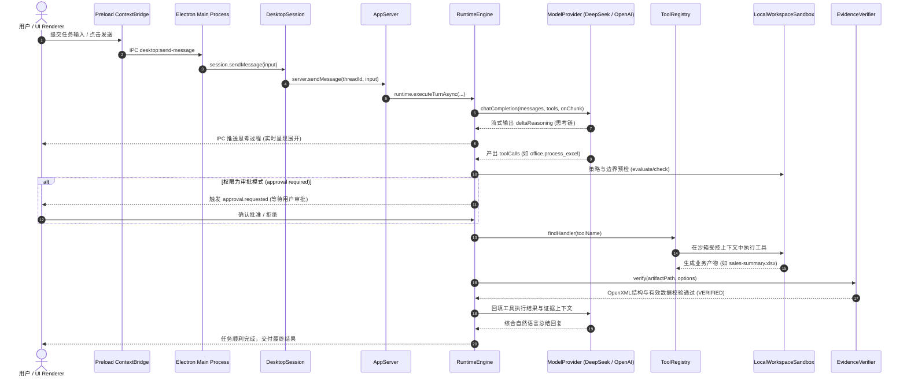

# 01 执行主链路与生命周期

本文档详述 Agent_XXXXX 从接收到用户 Prompt，到最终完成产物验证的端到端执行全过程。

---

## 完整执行时序图

---

## 生命周期关键阶段详解

1. **输入与意图路由阶段**：
   - 渲染进程通过 `window.agentDesktop.sendMessage` 触发；
   - `IntentRouter` 与模型提供商结合，区分纯对话闲聊与办公自动化操作；闲聊即时回复，操作任务触发 ReAct 循环。
2. **模型流式推理与思考披露**：
   - 支持官方 DeepSeek R1 深度思考链（通过 `deltaReasoning`）独立回填；
   - 前端实时展开“思考中…”折叠气泡，展现真实的 CoT 逻辑。
3. **工具调度与双重沙箱拦截**：
   - 调度统一经由 `ToolRegistry`，杜绝私有分支；
   - `LocalWorkspaceSandbox` 实施路径规范化与路径穿越拦截（`..` 防护）；
   - `ApprovalPolicy` 实施 5 级权限拦截（只读、工作区写入、外部访问等）。
4. **物理证据链核验**：
   - 任务完成状态不取决于大模型的自述，而是由 `EvidenceVerifier` 物理读取磁盘文件；
   - 核验文件存在、非空、OpenXML ZIP 容器完整度及数据语法；核验通过才标记 `VERIFIED`。
