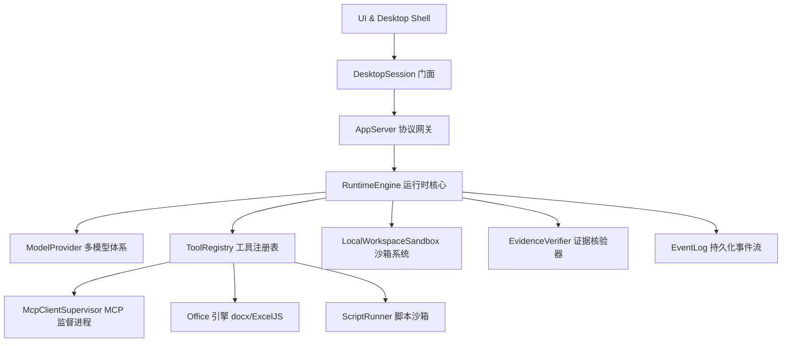

# 02 核心模块划分与源码图谱

本章节梳理 Agent_XXXXX 的核心模块职责划分与精确的源码锚点。

---

## 模块地图

---

## 核心子模块索引

| 子模块 | 核心源码位置 | 职责说明 |
| :--- | :--- | :--- |
| **运行时核心 (Runtime Engine)** | [`src/runtime/engine.ts`](../../src/runtime/engine.ts) | 任务轮次调度、状态机控制、审批拦截与全链路事件编排 |
| **应用服务协议 (App Server)** | [`src/runtime/app-server.ts`](../../src/runtime/app-server.ts) | 解耦 UI 与运行时的标准协议层，纳管 thread 与 turn |
| **模型接入体系 (Model Provider)** | [`src/runtime/model-provider.ts`](../../src/runtime/model-provider.ts) | DeepSeek/OpenAI 兼容客户端、思考链提取、参数构建与动态发现 |
| **工具注册与 MCP (Tools & MCP)** | [`src/runtime/tools/`](../../src/runtime/tools/) | 统一下发安全上下文的标准工具处理器与外部 MCP 桥接器 |
| **工作区沙箱 (Sandbox)** | [`src/runtime/sandbox.ts`](../../src/runtime/sandbox.ts) | 路径穿越防御、只读/写权限校验、工作区真实文件隔离 |
| **证据核验器 (Verifier)** | [`src/runtime/verifier.ts`](../../src/runtime/verifier.ts) | 物理证据校验（Docx 结构、Excel 结构、JSON 结构、哈希校验） |
| **桌面工作台 (Workbench UI)** | [`src/desktop/renderer.ts`](../../src/desktop/renderer.ts) | 沉浸式桌面交互、双侧栏伸缩、设置弹窗、流式消息渲染 |
